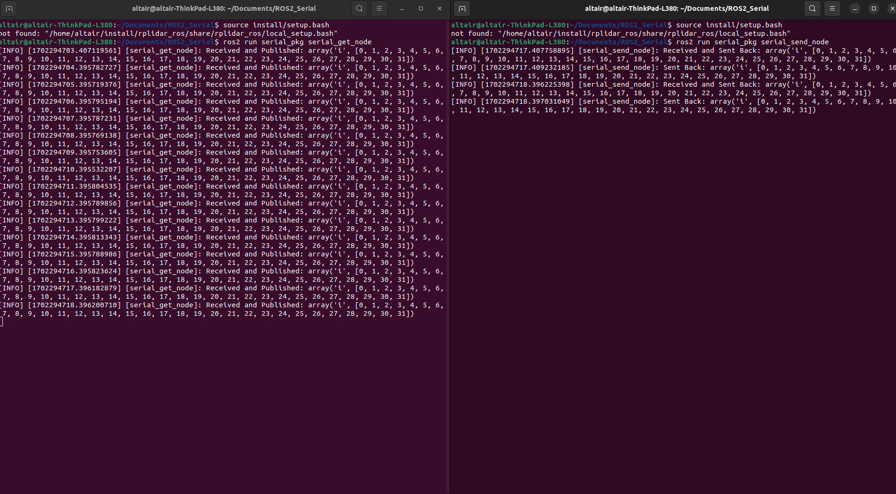

# シリアル通信[PC<->Arduino UNO R4]
codeの中にプログラム入れてます．
serial.py

```py

import serial

data = [0, 0, 0, 0, 0, 0, 0, 0, 0, 0, 0, 0, 0, 0, 0, 0,]

ser = serial.Serial("/dev/ttyACM0", baudrate=9600)

while True:
    ser.write(bytes(data))  
    received_data = ser.read(16)
    
    for a in range(16):
        data[a] = received_data[a]

    print(data)
```
`import serial`: Pythonのserialモジュールをインポート

`data = [0, 0, 0, 0, 0, 0, 0, 0, 0, 0, 0, 0, 0, 0, 0, 0]`: 16個の要素を持つリストdataを作成  64まで確認済み

`ser = serial.Serial("/dev/ttyACM0", baudrate=9600)`: シリアルポートを開く.Arduinoが接続されているポート（"/dev/ttyACM0"）と通信速度（baudrate=9600）

`ser.write(bytes(data))`: dataリストをバイトに変換してArduinoに送信.ser.writeメソッドを使用してデータをシリアルポートへ

`received_data = ser.read(16)`: Arduinoからのデータを16バイト読み取り.

`for a in range(16): data[a] = received_data[a]`: 受信したデータを元のdataリストにコピー次のループで同じデータを送信することが可能

ros2-serial.ino
```c
#include <SoftwareSerial.h>

uint8_t send_data[32];
uint8_t receive_data[32];

void setup() {
  Serial.begin(9600);
  pinMode(LED_BUILTIN, OUTPUT);
}

void loop() {
  for (int a = 0; a < 32; a++) send_data[a] = a;
  Serial.write(send_data, 32);

  //delay(100);  

  if (Serial.available() >= 32) {
    Serial.readBytes(receive_data, 32);

    if (receive_data[0] >= 2 && receive_data[0] <= 8) {
      digitalWrite(LED_BUILTIN, HIGH);
    } else {
      digitalWrite(LED_BUILTIN, LOW);
    }
  }
}

```
64まで確認済み
UNO R4 minimaであればdelayなしで通信可能でした．
# ROS2ノード
serial_get_nodeはマイコンから受取，serial_send_nodeはマイコンに送信している．
```
ros2 run serial_pkg serial_get_node
ros2 run serial_pkg serial_send_node
```

